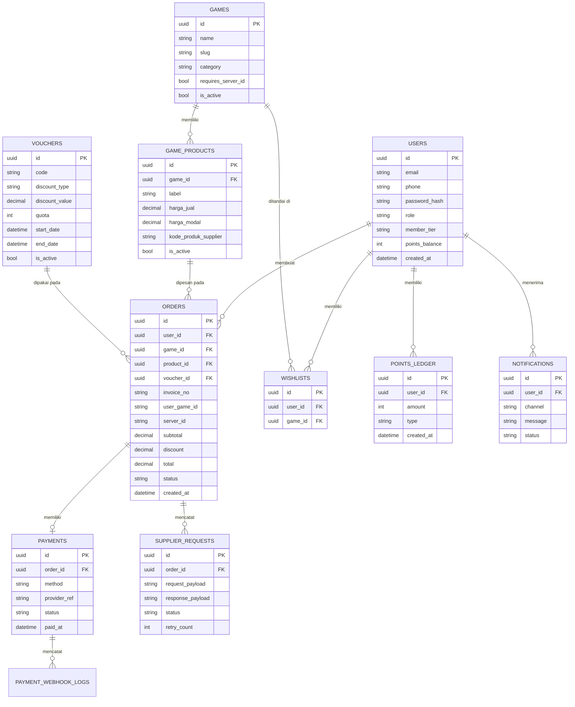

# Topup Kilat - Product Requirements Document

**Versi:** 1.0
**Status:** Draft untuk review tim (UI/UX, Frontend, Backend, PM)
**Kategori produk:** Marketplace top up game (diamond, UC, CP, Genesis Crystal, dll)
**Referensi format:** Struktur dokumen ini mengikuti pola penomoran section (§) seperti pada wireframe *WillYouMarryMe*, agar setiap halaman/komponen frontend dapat merujuk balik ke section requirement yang relevan.

---

## Daftar Isi

1. Executive Summary
2. Product Vision
3. Product Goals
4. Business Objectives
5. User Persona
6. User Journey
7. User Flow
8. Information Architecture
9. Sitemap
10. Functional Requirements
11. Non-Functional Requirements
12. Frontend Requirements
13. Backend Requirements
14. Database Design
15. ERD
16. API Specification
17. Authentication & Authorization
18. Payment Gateway Integration
19. Transaction Flow
20. Admin Panel Requirements
21. CMS Requirements
22. Security Requirements
23. Performance Requirements
24. SEO Requirements
25. Accessibility
26. Responsive Design
27. Notification System
28. Analytics
29. Logging
30. Error Handling
31. Edge Cases
32. Tech Stack Recommendation
33. Folder Structure
34. Deployment Architecture
35. CI/CD Recommendation
36. Third Party Integration
37. Testing Strategy
38. MVP Scope
39. Future Roadmap

---

## 1. Executive Summary

**Topup Kilat** adalah platform top up game yang memungkinkan pengguna membeli diamond, UC, CP, Genesis Crystal, dan mata uang virtual game populer lainnya secara instan, aman, dan tanpa ribet. Alur inti produk: pilih game → masukkan User ID (dan Server ID bila perlu) → pilih nominal → (opsional) masukkan voucher → pilih metode pembayaran → bayar → pesanan diproses otomatis → status transaksi terlihat real-time.

Produk ini dibangun sebagai aplikasi full-stack: frontend publik, backend/API, database transaksional, admin panel operasional, integrasi API supplier game, integrasi payment gateway, sistem autentikasi, lapisan keamanan, dan arsitektur deployment yang siap produksi.

Dokumen ini adalah acuan tunggal (single source of truth) bagi UI/UX Designer, Frontend Developer, Backend Developer, QA, dan Project Manager selama proses pembangunan Topup Kilat dari nol hingga rilis produksi.

## 2. Product Vision

> Menjadi platform top up game tercepat dan paling dipercaya di Indonesia — tempat gamer, orang tua, streamer, joki, dan reseller menyelesaikan transaksi top up dalam hitungan detik, dengan pengalaman visual yang modern dan premium setara produk gaming kelas atas.

Visi ini diterjemahkan menjadi tiga pilar produk:

- **Kilat (kecepatan):** checkout ≤ 4 langkah, proses order otomatis, status real-time.
- **Kepercayaan:** transaksi aman, invoice digital, riwayat transparan, dukungan responsif.
- **Pengalaman premium:** UI dark-mode gaming style yang tidak terasa seperti "toko generik".

## 3. Product Goals

| # | Goal | Indikator Keberhasilan |
|---|------|-------------------------|
| G1 | Mempercepat proses top up dari pencarian game hingga pembayaran | Rata-rata waktu checkout < 90 detik |
| G2 | Menjamin proses order otomatis tanpa intervensi manual admin | > 95% order sukses diproses otomatis via API supplier |
| G3 | Memberikan visibilitas status transaksi real-time | Update status < 5 detik setelah callback payment/supplier |
| G4 | Membangun kepercayaan pengguna baru | Rating kepuasan checkout ≥ 4.5/5 |
| G5 | Mendorong retensi lewat promo & loyalitas | ≥ 30% transaksi berulang dalam 90 hari |

## 4. Business Objectives

- Menghasilkan revenue dari margin harga jual mata uang game dan fee metode pembayaran tertentu.
- Membangun basis pengguna berulang (gamer, reseller, joki) sebagai sumber recurring revenue.
- Memperluas katalog game secara rutin untuk menjaga relevansi pasar.
- Menekan biaya operasional lewat otomatisasi penuh proses order (tanpa proses manual admin per transaksi).
- Membangun data pengguna & transaksi sebagai dasar personalisasi promo dan program loyalitas.
- Menjaga tingkat churn rendah melalui program member, cashback, dan poin reward.

## 5. User Persona

### Persona 1 — "Rafi", Gamer Aktif (18–24 tahun)
Top up mingguan untuk 2–3 game mobile favorit. Mengutamakan kecepatan proses dan promo. Sensitif terhadap harga, sering membandingkan dengan kompetitor sebelum membeli.

### Persona 2 — "Ibu Sari", Orang Tua (35–45 tahun)
Membelikan diamond untuk anaknya. Awam dengan istilah teknis game (User ID/Server ID), butuh alur yang sangat jelas dan panduan visual, mengutamakan keamanan transaksi dan metode pembayaran familiar (e-wallet, transfer bank).

### Persona 3 — "Vio", Streamer/Content Creator
Top up jumlah besar dan sering, kadang mendadak saat live streaming. Butuh proses super cepat, riwayat transaksi rapi untuk laporan konten, serta metode pembayaran fleksibel.

### Persona 4 — "Bagas", Joki Game
Melakukan top up berulang dalam volume besar untuk banyak akun klien berbeda dalam waktu singkat. Butuh checkout ulang cepat (repeat order), riwayat User ID tersimpan.

### Persona 5 — "Toko Dimas", Reseller
Membeli diamond dalam jumlah besar untuk dijual kembali. Membutuhkan harga grosir/tingkatan harga khusus, laporan transaksi terperinci, dan kemungkinan integrasi API di masa depan.

## 6. User Journey

Contoh journey persona "Rafi" (gamer aktif):

1. **Awareness:** Menemukan Topup Kilat lewat iklan media sosial/referral teman.
2. **Landing:** Membuka homepage, melihat daftar game populer & promo aktif tanpa perlu login.
3. **Discovery:** Mencari game favoritnya lewat search/kategori, melihat harga tiap nominal diamond.
4. **Decision:** Membandingkan promo, memilih nominal yang sesuai budget.
5. **Input:** Memasukkan User ID & Server ID, sistem memvalidasi/menampilkan preview nickname (bila API supplier mendukung).
6. **Promo:** Memasukkan kode voucher jika ada.
7. **Payment:** Memilih e-wallet favoritnya, membayar via redirect/QRIS scan.
8. **Fulfillment:** Menerima notifikasi status "Diproses" lalu "Berhasil" dalam hitungan detik–menit.
9. **Retention:** Kembali seminggu kemudian karena riwayat transaksi & voucher loyalitas mendorongnya repeat order.

## 7. User Flow

Alur inti (happy path) direpresentasikan sebagai berikut:

```
[Landing Page]
   → (opsional) [Cari/Pilih Kategori Game]
   → [Halaman Detail Top Up Game] (/topup/[slug])
        → Input User ID (+ Server ID jika perlu)
        → Validasi ID (cek nickname via API supplier, opsional)
        → Pilih Nominal Diamond/Item
        → Input Kode Voucher (opsional)
   → [Ringkasan Order]
        → Login/Register (wajib jika belum login)
   → [Checkout / Pilih Metode Pembayaran]
        → QRIS / E-Wallet / Virtual Account / Transfer Bank
   → [Redirect / Tampilkan Instruksi Bayar]
   → [Webhook Payment Gateway diterima]
   → [Sistem Trigger Order ke API Supplier Game]
   → [Callback Supplier diterima]
   → [Status Transaksi: Berhasil / Gagal]
   → [Notifikasi ke User] + [Invoice Digital]
   → [Halaman Riwayat Transaksi]
```

Alur alternatif penting:
- **Guest checkout parsial:** Guest dapat mengisi ID & memilih nominal tanpa login, tapi wajib login/register sebelum tahap pembayaran.
- **Simulasi tanpa login:** User dapat "simulasi" seluruh alur input hingga ringkasan order tanpa membuat transaksi nyata, untuk melihat total harga.
- **Repeat order:** User login dapat mengulang transaksi sebelumnya satu klik dari riwayat transaksi (User ID & Server ID otomatis terisi).

## 8. Information Architecture

```
Topup Kilat
├── Publik
│   ├── Home
│   ├── Semua Game (kategori: Mobile, PC, Voucher, dll)
│   ├── Detail Top Up Game
│   ├── Promo & Voucher
│   ├── Bantuan/FAQ
│   ├── Tentang & Kontak
├── Akun (butuh login)
│   ├── Login / Register / Lupa Password
│   ├── Profil
│   ├── Riwayat Transaksi
│   ├── Wishlist/Favorit Game
│   ├── Poin & Loyalitas
├── Checkout (semi-publik → wajib login sebelum bayar)
│   ├── Ringkasan Order
│   ├── Pilih Pembayaran
│   ├── Status Pembayaran
├── Admin (role: Admin/CS/Finance)
│   ├── Dashboard Overview
│   ├── Manajemen Produk/Game
│   ├── Manajemen Promo & Voucher
│   ├── Manajemen Transaksi & Refund
│   ├── Manajemen Pengguna
│   ├── Laporan & Analytics
│   ├── Pengaturan Sistem (payment channel, API supplier, dll)
```

## 9. Sitemap

| Halaman | Route | Akses |
|---|---|---|
| Landing | `/` | Publik |
| Daftar Game | `/games` | Publik |
| Detail Top Up | `/topup/[slug]` | Publik (checkout perlu login) |
| Promo | `/promo` | Publik |
| Login | `/login` | Guest |
| Register | `/register` | Guest |
| Lupa Password | `/forgot-password` | Guest |
| Checkout | `/checkout` | User (login wajib) |
| Status Transaksi | `/transaksi/[invoiceId]` | User/Guest (via link invoice) |
| Riwayat Transaksi | `/dashboard/riwayat` | User |
| Wishlist | `/dashboard/wishlist` | User |
| Profil | `/dashboard/profil` | User |
| Poin & Loyalitas | `/dashboard/poin` | User |
| FAQ/Bantuan | `/bantuan` | Publik |
| Admin — Overview | `/admin` | Admin |
| Admin — Produk | `/admin/produk` | Admin |
| Admin — Promo | `/admin/promo` | Admin |
| Admin — Transaksi | `/admin/transaksi` | Admin/Finance |
| Admin — Pengguna | `/admin/pengguna` | Admin |
| Admin — Laporan | `/admin/laporan` | Admin |
| Admin — Pengaturan | `/admin/pengaturan` | Super Admin |

## 10. Functional Requirements

### 10.1 Landing & Discovery
- FR-01: Menampilkan daftar game populer tanpa login.
- FR-02: Menampilkan promo aktif di homepage.
- FR-03: Search game by nama.
- FR-04: Filter/kategori game (Mobile, PC/Console, Voucher, dll).
- FR-05: Simulasi pembelian (lihat harga & ringkasan) tanpa login.

### 10.2 Halaman Detail Top Up
- FR-06: Input User ID, dan Server ID jika game memerlukannya (config per-game).
- FR-07: Validasi/preview nickname akun via API supplier (bila tersedia), fallback manual bila API tidak mendukung.
- FR-08: Pilihan nominal diamond/item ditampilkan sebagai grid harga.
- FR-09: Input kode voucher/promo dengan validasi real-time (valid/kadaluarsa/tidak berlaku untuk item ini).

### 10.3 Autentikasi
- FR-10: Register via email/nomor HP + password.
- FR-11: Login via email/HP + password, dan OAuth Google.
- FR-12: Lupa password via OTP/email reset link.
- FR-13: Guest dapat browsing & simulasi tanpa login; wajib login sebelum checkout final.

### 10.4 Checkout & Pembayaran
- FR-14: Ringkasan order (game, ID, nominal, voucher, total).
- FR-15: Pilihan metode pembayaran: QRIS, E-Wallet (GoPay/OVO/DANA/ShopeePay), Virtual Account (BCA/BNI/BRI/Mandiri, dll), Transfer Bank.
- FR-16: Generate transaksi & redirect/tampilkan instruksi pembayaran dari payment gateway.
- FR-17: Update status transaksi otomatis dari webhook payment gateway.

### 10.5 Fulfillment Otomasi
- FR-18: Setelah pembayaran terkonfirmasi, sistem otomatis memanggil API supplier untuk memproses top up.
- FR-19: Callback dari supplier memperbarui status order (Berhasil/Gagal/Diproses).
- FR-20: Retry otomatis (dengan batas percobaan) bila API supplier timeout/gagal sementara.

### 10.6 Riwayat & Status
- FR-21: Status transaksi real-time (Menunggu Pembayaran → Diproses → Berhasil/Gagal).
- FR-22: Riwayat transaksi lengkap dengan filter tanggal/status/game.
- FR-23: Invoice digital dapat diunduh (PDF) per transaksi.
- FR-24: Repeat order satu klik dari riwayat.

### 10.7 Wishlist & Loyalitas
- FR-25: Tandai/hapus game favorit (wishlist).
- FR-26: Program poin: setiap transaksi sukses menambah poin sesuai nominal.
- FR-27: Penukaran poin menjadi voucher diskon.
- FR-28: Tingkatan member (Bronze/Silver/Gold) dengan benefit berbeda (diskon, prioritas support).

### 10.8 Notifikasi
- FR-29: Notifikasi in-app & email untuk status pembayaran (berhasil/gagal) dan status order.
- FR-30: (Opsional MVP+1) Notifikasi WhatsApp/SMS.

### 10.9 Admin Panel
- FR-31: CRUD data game & daftar nominal/harga per game.
- FR-32: CRUD promo & voucher (jenis: potongan %, potongan nominal, cashback poin), dengan aturan masa berlaku & kuota.
- FR-33: Monitoring & manajemen transaksi (lihat detail, retry manual, refund).
- FR-34: Manajemen pengguna (lihat profil, blokir, reset password).
- FR-35: Laporan penjualan (harian/mingguan/bulanan), per game, per metode pembayaran.
- FR-36: Pengaturan sistem: kredensial API supplier, kredensial payment gateway, margin harga.

## 11. Non-Functional Requirements

| Kategori | Requirement |
|---|---|
| Ketersediaan | Uptime ≥ 99.5% (target produksi) |
| Skalabilitas | Backend stateless, horizontal-scalable di belakang load balancer |
| Waktu respons | API rata-rata < 300ms (non-payment), checkout page load < 2 detik |
| Konsistensi data | Transaksi finansial menggunakan DB transaction (ACID) — tidak boleh ada order "hilang" |
| Auditability | Semua perubahan status transaksi tercatat dengan timestamp & aktor |
| Kompatibilitas | Mendukung browser modern (Chrome, Safari, Firefox, Edge) versi 2 tahun terakhir |
| Lokalisasi | Bahasa Indonesia sebagai default, struktur siap untuk multi-bahasa di masa depan |
| Maintainability | Kode modular, terdokumentasi, mengikuti konvensi tech stack yang direkomendasikan |

## 12. Frontend Requirements

- Dibangun dengan **Next.js 15 (App Router)** + React + TypeScript agar mendukung SSR/ISR untuk SEO halaman game & promo.
- Styling dengan **Tailwind CSS**, animasi halus dengan **Framer Motion** (micro-interaction pada hover kartu game, transisi checkout step, skeleton loading).
- Desain **dark mode default**, gaming style, minimalis, dominan warna **biru, ungu, cyan** dengan aksen neon (lihat §"Desain UI/UX" pada brief awal).
- State management ringan (React Context/Zustand) untuk state checkout multi-step.
- Form handling dengan validasi client-side (react-hook-form + zod) sebelum request ke backend.
- Komponen utama yang wajib ada: GameCard, NominalGrid Selector, PaymentMethodSelector, StepIndicator Checkout, StatusBadge (real-time), ToastNotification, SkeletonLoader.
- Real-time status transaksi menggunakan koneksi **Socket.io** (fallback polling tiap 5 detik jika socket gagal connect).
- Semua halaman wajib responsive (lihat §26).

## 13. Backend Requirements

- Dibangun dengan **NestJS + TypeScript**, arsitektur modular per domain (Auth, Users, Games, Products, Promo, Orders, Payments, Notifications, Admin).
- Setiap modul memiliki Controller – Service – Repository (via Prisma) yang terpisah agar mudah diuji.
- Idempotency key wajib pada endpoint pembuatan order & webhook payment, untuk mencegah duplikasi akibat retry.
- Job queue (BullMQ + Redis) untuk: pemrosesan order ke API supplier, pengiriman notifikasi, generate invoice PDF, retry otomatis.
- Rate limiting per-IP dan per-user pada endpoint sensitif (login, checkout, redeem voucher).
- Webhook handler payment gateway & supplier harus **idempotent** dan memverifikasi signature/HMAC sebelum diproses.

## 14. Database Design

Entitas inti (nama tabel indikatif, disesuaikan konvensi Prisma):

- `users` — data akun pengguna (email, phone, password_hash, role, member_tier, points_balance)
- `games` — katalog game (nama, slug, kategori, logo, requires_server_id, is_active)
- `game_products` — nominal/item per game (game_id, label, harga_jual, harga_modal, kode_produk_supplier, stok/status)
- `vouchers` — kode promo (kode, tipe_diskon, nilai, kuota, min_transaksi, tanggal_mulai, tanggal_berakhir, is_active)
- `orders` — transaksi (user_id, game_id, product_id, user_game_id, server_id, voucher_id, subtotal, diskon, total, status, invoice_no)
- `payments` — detail pembayaran per order (order_id, metode, provider_ref, status, paid_at)
- `payment_webhook_logs` — log mentah webhook masuk untuk audit & debugging
- `supplier_requests` — log request/response ke API supplier per order (untuk retry & audit)
- `wishlists` — relasi user_id–game_id
- `notifications` — riwayat notifikasi terkirim per user
- `points_ledger` — mutasi poin (earn/redeem) per user
- `admin_activity_logs` — audit trail aksi admin (CRUD produk, promo, refund, dsb)

## 15. ERD



## 16. API Specification

Contoh endpoint inti (REST, prefix `/api/v1`):

| Method | Endpoint | Deskripsi | Auth |
|---|---|---|---|
| GET | `/games` | Daftar game + kategori | Publik |
| GET | `/games/:slug` | Detail game & daftar produk/nominal | Publik |
| POST | `/games/:slug/validate-id` | Validasi User ID/Server ID via supplier | Publik |
| POST | `/vouchers/validate` | Validasi kode voucher terhadap order draft | User |
| POST | `/auth/register` | Registrasi akun | Guest |
| POST | `/auth/login` | Login (email/HP + password) | Guest |
| POST | `/auth/oauth/google` | Login via Google OAuth | Guest |
| POST | `/auth/refresh` | Refresh access token | User (refresh token) |
| POST | `/orders` | Buat order baru (draft, sebelum bayar) | User |
| POST | `/orders/:id/checkout` | Inisiasi pembayaran ke payment gateway | User |
| GET | `/orders/:id` | Detail status transaksi | User/Guest via invoice token |
| GET | `/orders` | Riwayat transaksi user | User |
| POST | `/webhooks/payment` | Callback dari payment gateway | Signature HMAC |
| POST | `/webhooks/supplier` | Callback dari API supplier game | Signature HMAC |
| GET | `/wishlists` / `POST` / `DELETE` | Kelola wishlist | User |
| GET | `/points` | Saldo & histori poin | User |
| **Admin** | | | |
| GET/POST/PUT/DELETE | `/admin/games`, `/admin/products` | CRUD katalog | Admin |
| GET/POST/PUT/DELETE | `/admin/vouchers` | CRUD promo | Admin |
| GET | `/admin/orders` | Monitoring transaksi | Admin/Finance |
| POST | `/admin/orders/:id/retry` | Retry manual ke supplier | Admin |
| POST | `/admin/orders/:id/refund` | Proses refund | Admin/Finance |
| GET | `/admin/reports` | Laporan penjualan | Admin |

Format response standar:
```json
{
  "success": true,
  "data": { },
  "meta": { "page": 1, "totalPages": 5 },
  "error": null
}
```

## 17. Authentication & Authorization

- **Metode:** JWT access token (short-lived, 15 menit) + refresh token (long-lived, 7–30 hari, rotasi setiap pemakaian) + OAuth Google.
- **Password storage:** bcrypt/argon2 hash, tidak pernah disimpan plaintext.
- **RBAC (Role-Based Access Control):**

| Role | Akses |
|---|---|
| Guest | Browsing, simulasi, validasi ID, lihat harga |
| User | Semua akses Guest + checkout, riwayat, wishlist, poin |
| CS (Customer Service) | Lihat detail transaksi, tidak bisa ubah harga/produk |
| Finance | Lihat transaksi & laporan, proses refund |
| Admin | Full akses admin panel kecuali pengaturan kredensial sistem |
| Super Admin | Semua akses termasuk kredensial API supplier & payment gateway |

- Endpoint sensitif (checkout, redeem voucher, refund) wajib dilindungi middleware guard + rate limiting.

## 18. Payment Gateway Integration

- Metode pembayaran: **QRIS, E-Wallet (GoPay/OVO/DANA/ShopeePay), Virtual Account (BCA/BNI/BRI/Mandiri/Permata), Transfer Bank**.
- Alur integrasi:
  1. Backend membuat transaksi di sisi payment gateway (`POST /orders/:id/checkout`) dan menerima `payment_url`/kode QRIS/nomor VA.
  2. Frontend menampilkan instruksi pembayaran sesuai metode.
  3. Payment gateway mengirim **webhook** ke `/webhooks/payment` saat status berubah (paid/expired/failed).
  4. Backend memverifikasi signature webhook, memperbarui status `payments` & `orders`, lalu memicu proses fulfillment (§19).
- Penanganan **expired payment**: order otomatis dibatalkan setelah batas waktu (mis. 60 menit), stok/kuota voucher dikembalikan jika berlaku.
- Rekonsiliasi harian otomatis antara data internal dan laporan payment gateway untuk mendeteksi selisih.

## 19. Transaction Flow

```
1. User submit order (status: PENDING_PAYMENT)
2. User pilih metode bayar → redirect/instruksi pembayaran
3. Payment gateway kirim webhook "paid"
   → status order: PAID
4. Sistem trigger job ke API supplier (queue, dengan idempotency key)
   → status order: PROCESSING
5a. Supplier callback sukses → status: SUCCESS → invoice digital + notifikasi
5b. Supplier callback gagal → retry otomatis (maks N kali)
   → jika tetap gagal: status: FAILED → trigger refund otomatis/manual + notifikasi
```

Semua perpindahan status dicatat di tabel audit (`admin_activity_logs`/`supplier_requests`) dengan timestamp, agar dapat direkonstruksi jika terjadi dispute.

## 20. Admin Panel Requirements

- Dashboard overview: total transaksi hari ini, revenue, transaksi pending, grafik tren penjualan, funnel checkout (order dibuat → dibayar → sukses).
- Manajemen produk: tambah/edit/nonaktifkan game & nominal, atur harga jual & margin.
- Manajemen promo: buat voucher dengan kuota, tanggal berlaku, minimum transaksi, target game tertentu (opsional).
- Manajemen transaksi: pencarian by invoice/User ID/tanggal, detail lengkap termasuk log request ke supplier, tombol retry manual & refund.
- Manajemen pengguna: lihat profil, riwayat transaksi per user, blokir akun bila terindikasi fraud.
- Laporan: ekspor CSV/Excel untuk laporan penjualan periode tertentu.
- Log audit: setiap aksi admin (edit harga, refund, blokir user) tercatat dengan nama admin & waktu.

## 21. CMS Requirements

- Admin dapat mengelola konten dinamis non-transaksional: banner promo homepage, artikel FAQ/bantuan, halaman "Tentang Kami", pengumuman/maintenance notice.
- Editor konten sederhana (rich text/markdown) untuk FAQ dan halaman statis, tanpa perlu deploy ulang frontend.
- Manajemen SEO metadata per halaman (title, description, OG image) — lihat §24.

## 22. Security Requirements

- Enkripsi data sensitif saat transit (HTTPS/TLS wajib di semua environment).
- Verifikasi signature/HMAC pada seluruh webhook masuk (payment gateway & supplier) sebelum diproses.
- Proteksi terhadap brute force login (rate limiting + captcha setelah beberapa percobaan gagal).
- Validasi & sanitasi input di sisi backend (mencegah SQL injection lewat parameterized query via Prisma, XSS lewat output escaping).
- Secrets (API key supplier, kredensial payment gateway) disimpan di environment variable/secret manager, tidak pernah di-commit ke repository.
- Audit log untuk seluruh aksi admin dan perubahan status transaksi.
- Kebijakan data pribadi sesuai UU PDP: minimalisasi data yang disimpan, retensi data jelas, mekanisme penghapusan akun atas permintaan user.

## 23. Performance Requirements

- Time to First Byte (TTFB) halaman publik < 200ms (dengan caching/ISR).
- API checkout end-to-end (submit order → dapat instruksi bayar) < 2 detik.
- Update status real-time ke frontend < 5 detik setelah webhook diterima backend.
- Caching Redis untuk data katalog game/produk yang jarang berubah (invalidasi saat admin update).
- Database indexing pada kolom pencarian utama: `orders.invoice_no`, `orders.user_id`, `games.slug`.

## 24. SEO Requirements

- SSR/ISR untuk halaman game & promo agar dapat diindeks mesin pencari.
- Metadata dinamis (title, meta description, canonical URL, Open Graph) per halaman game.
- Structured data (schema.org `Product`/`Offer`) pada halaman detail top up.
- Sitemap XML otomatis untuk seluruh halaman game aktif.
- URL bersih dan deskriptif, contoh: `/topup/mobile-legends`, `/topup/free-fire`.

## 25. Accessibility

- Kontras warna teks terhadap background dark-mode memenuhi standar WCAG AA minimum.
- Seluruh elemen interaktif dapat diakses via keyboard (tab order logis).
- Label ARIA pada komponen custom (dropdown nominal, step checkout, modal voucher).
- Ukuran target sentuh (tap target) minimum 44x44px pada versi mobile.
- Alt text pada seluruh gambar produk/game.

## 26. Responsive Design

- Breakpoint utama: mobile (< 640px), tablet (640–1024px), desktop (> 1024px).
- Grid game/produk menyesuaikan jumlah kolom per breakpoint (2 kolom mobile, 3–4 tablet, 5–6 desktop).
- Checkout step di mobile ditampilkan sebagai alur vertikal penuh (bukan multi-kolom seperti desktop).
- Navigasi mobile menggunakan bottom bar atau hamburger menu, bukan sidebar tetap.

## 27. Notification System

- Kanal: in-app notification, email (transaksional & marketing terpisah), opsional WhatsApp/SMS di roadmap.
- Trigger notifikasi: pembayaran diterima, order diproses, order sukses/gagal, promo baru, poin/reward didapat.
- Template notifikasi dikelola terpusat (bisa diedit tanpa deploy ulang) melalui modul CMS/admin.
- Preferensi notifikasi dapat diatur oleh user (opt-out marketing, tetap menerima transaksional).

## 28. Analytics

- Integrasi **Google Analytics 4** untuk funnel: landing → detail game → checkout → payment success.
- Event kustom: `view_game`, `add_to_checkout`, `apply_voucher`, `select_payment_method`, `checkout_success`, `checkout_failed`.
- Dashboard internal admin menampilkan metrik bisnis: revenue harian, top game terlaris, conversion rate checkout, average order value.

## 29. Logging

- Structured logging (JSON) di seluruh service backend, dikirim ke log aggregator (mis. Sentry untuk error, atau logging service terpisah untuk access log).
- Log wajib mencakup: request ID, user ID (jika ada), endpoint, status code, durasi request.
- Log khusus untuk webhook masuk (`payment_webhook_logs`) disimpan mentah untuk kebutuhan audit/dispute.
- Retensi log minimal 90 hari untuk kebutuhan investigasi transaksi.

## 30. Error Handling

- Format error response konsisten:
```json
{
  "success": false,
  "data": null,
  "error": { "code": "VOUCHER_EXPIRED", "message": "Kode voucher sudah tidak berlaku" }
}
```
- Kode error terstandarisasi per domain (AUTH_xxx, ORDER_xxx, PAYMENT_xxx, SUPPLIER_xxx) agar frontend dapat menampilkan pesan yang sesuai tanpa hardcode string.
- Kesalahan dari pihak ketiga (payment gateway/supplier down) ditangani dengan pesan yang jelas ke user ("Pembayaran sedang mengalami gangguan, coba beberapa saat lagi") tanpa membocorkan detail teknis.

## 31. Edge Cases

- User membayar tapi webhook payment terlambat/tidak diterima → perlu mekanisme reconciliation/polling cadangan ke API payment gateway secara berkala.
- Supplier API sukses tapi callback gagal terkirim → sistem melakukan polling status ke supplier sebagai fallback.
- User submit order dengan User ID salah → status FAILED setelah callback supplier, dengan opsi refund otomatis.
- Voucher dipakai bersamaan oleh banyak user melebihi kuota (race condition) → gunakan row-level locking/transaction saat redeem kuota.
- User mencoba retry pembayaran pada order yang sudah expired → sistem membuat order baru, order lama ditandai EXPIRED.
- Harga produk berubah di tengah proses checkout → order mengunci harga saat draft dibuat, tidak terpengaruh perubahan harga setelahnya.
- Pembayaran ganda (double payment) untuk satu order akibat user klik dua kali → idempotency key mencegah pembuatan order duplikat.

## 32. Tech Stack Recommendation

| Layer | Teknologi |
|---|---|
| Frontend | Next.js 15 + React + TypeScript + Tailwind CSS + Framer Motion |
| Backend | NestJS + TypeScript |
| Database | PostgreSQL |
| ORM | Prisma |
| Autentikasi | JWT + Refresh Token + OAuth Google |
| Storage | Cloudflare R2 atau AWS S3 |
| Payment Gateway | Sakurupiah |
| Realtime | Socket.io |
| Caching & Queue | Redis (+ BullMQ) |
| Deployment Frontend | Vercel |
| Deployment Backend | Railway atau VPS Docker |
| Database Hosting | Supabase PostgreSQL atau Neon |
| Monitoring Error | Sentry |
| Analytics | Google Analytics 4 |
| Admin Dashboard | Next.js Admin Panel (satu codebase dengan role-based route) |

## 33. Folder Structure

```
topup-kilat/
├── apps/
│   ├── web/                  # Next.js frontend (publik + dashboard user)
│   │   ├── app/
│   │   │   ├── (public)/
│   │   │   ├── (auth)/
│   │   │   ├── (dashboard)/
│   │   │   └── (checkout)/
│   │   ├── components/
│   │   ├── lib/
│   │   └── styles/
│   ├── admin/                 # Next.js admin panel (atau route group terpisah dalam web)
│   └── api/                   # NestJS backend
│       ├── src/
│       │   ├── modules/
│       │   │   ├── auth/
│       │   │   ├── users/
│       │   │   ├── games/
│       │   │   ├── products/
│       │   │   ├── vouchers/
│       │   │   ├── orders/
│       │   │   ├── payments/
│       │   │   ├── notifications/
│       │   │   └── admin/
│       │   ├── common/        # guards, interceptors, filters
│       │   ├── config/
│       │   └── main.ts
│       └── prisma/
│           └── schema.prisma
├── packages/
│   ├── ui/                    # shared UI components (bila monorepo)
│   └── types/                 # shared TypeScript types/DTO
├── docker-compose.yml
└── turbo.json / nx.json       # (opsional, jika monorepo)
```

## 34. Deployment Architecture

```
[User Browser]
     │
     ▼
[Vercel — Next.js Frontend/Admin] ──(REST/WebSocket)──▶ [Railway/VPS Docker — NestJS API]
                                                                │
                                    ┌───────────────────────────┼───────────────────────────┐
                                    ▼                           ▼                           ▼
                        [PostgreSQL — Supabase/Neon]   [Redis — Cache & Queue]   [Cloudflare R2/S3 — Storage]
                                    │
                                    ▼
                        [Payment Gateway Sakurupiah] ◀── webhook ──▶ [API Endpoint /webhooks/payment]
                                    │
                                    ▼
                        [API Supplier Game] ◀── webhook/polling ──▶ [API Endpoint /webhooks/supplier]

[Sentry] ◀── error tracking ── seluruh service
[GA4] ◀── event tracking ── frontend
```

- Backend di-deploy sebagai container Docker agar konsisten antara staging dan produksi.
- Load balancer/reverse proxy (mis. Nginx atau built-in platform) di depan backend untuk mendukung horizontal scaling.
- Environment terpisah: `development`, `staging`, `production`, masing-masing dengan kredensial payment gateway/supplier terpisah (sandbox vs live).

## 35. CI/CD Recommendation

- Repository terhubung ke pipeline (GitHub Actions):
  1. **Lint & Type Check** — ESLint + TypeScript compiler.
  2. **Unit Test** — Jest untuk backend, React Testing Library untuk frontend.
  3. **Build** — build Next.js & NestJS, gagal pipeline jika build error.
  4. **Migration Check** — validasi migrasi Prisma terhadap schema staging.
  5. **Deploy Staging** — otomatis pada merge ke branch `develop`.
  6. **Deploy Production** — manual approval pada merge ke branch `main`, deploy ke Vercel (frontend) & Railway/VPS (backend).
- Rollback plan: tag setiap release, mampu revert ke image/versi sebelumnya dalam < 5 menit.

## 36. Third Party Integration

- **Payment Gateway:** Sakurupiah (QRIS, e-wallet, VA, transfer bank).
- **API Supplier Game:** integrasi dengan satu atau lebih agregator top up game (untuk stok/kode produk & proses fulfillment).
- **OAuth Google:** login sosial.
- **Cloudflare R2/AWS S3:** penyimpanan aset (logo game, banner promo, invoice PDF).
- **Sentry:** error monitoring frontend & backend.
- **Google Analytics 4:** analitik perilaku pengguna.
- **Email Provider** (mis. Resend/SendGrid): pengiriman email transaksional & notifikasi.

## 37. Testing Strategy

| Jenis Test | Cakupan | Tools |
|---|---|---|
| Unit Test | Service/business logic backend (perhitungan harga, validasi voucher) | Jest |
| Integration Test | Endpoint API + database (menggunakan test database) | Jest + Supertest |
| E2E Test | Alur checkout penuh dari frontend hingga status transaksi | Playwright/Cypress |
| Load Test | Simulasi lonjakan transaksi (mis. saat promo besar) | k6/Artillery |
| Security Test | Penetration test dasar, dependency vulnerability scan | OWASP ZAP, `npm audit`/Snyk |
| UAT | Validasi bersama stakeholder sebelum rilis | Manual, checklist |

## 38. MVP Scope

**Termasuk dalam MVP:**
- Landing, daftar game, detail top up, input User ID/Server ID, pilihan nominal.
- Login/Register (email/HP + OAuth Google).
- Checkout dengan QRIS, e-wallet, VA (via Sakurupiah).
- Proses fulfillment otomatis ke minimal 1 API supplier.
- Status transaksi real-time + riwayat transaksi + invoice digital sederhana.
- Voucher/promo dasar (potongan %/nominal).
- Admin panel: manajemen produk, promo, monitoring transaksi, laporan dasar.
- Notifikasi in-app & email dasar.

**Di luar MVP (masuk roadmap selanjutnya):**
- Program poin & tingkatan member.
- Wishlist/favorit game.
- Notifikasi WhatsApp/SMS.
- Multi-supplier dengan smart routing (pilih supplier termurah/tercepat otomatis).
- Harga khusus reseller/API partner.

## 39. Future Roadmap

| Fase | Fokus |
|---|---|
| Fase 1 (MVP) | Alur top up inti, admin dasar, 1 payment gateway, 1 supplier |
| Fase 2 | Program loyalitas & poin, wishlist, notifikasi WhatsApp |
| Fase 3 | Multi-supplier routing otomatis, harga tingkat reseller, API publik untuk partner/joki |
| Fase 4 | Aplikasi mobile native (iOS/Android), program afiliasi/referral |
| Fase 5 | Ekspansi produk: voucher game digital lain, top up layanan streaming, marketplace akun game |

---

*Dokumen ini adalah acuan awal (v1.0) dan akan diperbarui seiring masukan dari tim UI/UX, Engineering, dan hasil validasi pengguna selama fase discovery lanjutan.*
